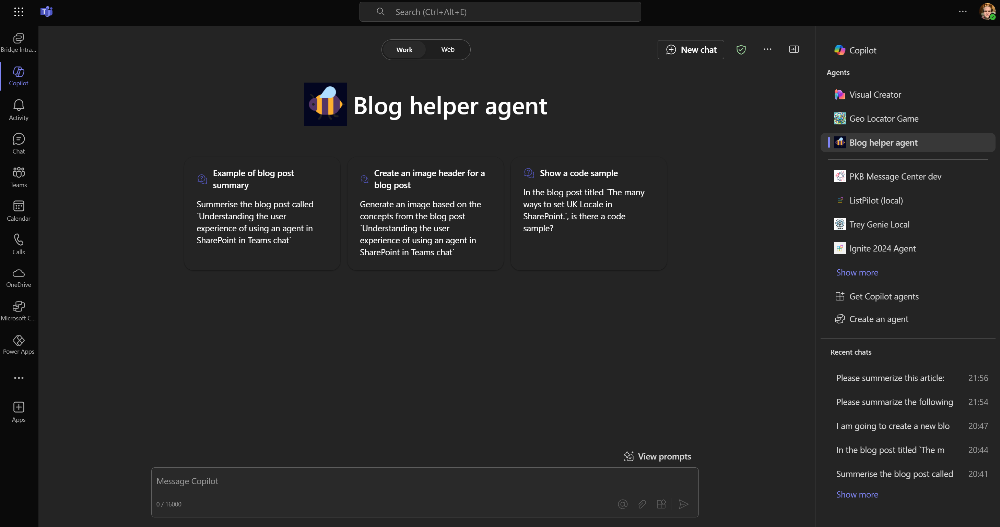

# Overview of the Blog Post Helper Declarative Agent sample

This sample helps users that often create blog post to help with elements of the creation process to get posts created quicker using capabilities within Declarative Agents.

Common features that the agent can help with:

 - Suggest an introduction based on a topic
 - Generate blog post header imagery - based on tools of “Microsoft Designer” to generate AI image headers to represent an article in the interest of speed. 
 - Review existing articles, or Find content that I would reference quickly.

This is based off the blog post: [Building a blog post helper agent for Microsoft 365 Copilot | pkbullock.com](https://pkbullock.com/blog/2025/building-a-blog-post-helper-agent-for-microsoft-365-copilot)

## Version history

Version|Date|Author|Comments
-------|----|----|--------
1.0|January 6th, 2025| Paul Bullock |Initial release

## Disclaimer

**THIS CODE IS PROVIDED *AS IS* WITHOUT WARRANTY OF ANY KIND, EITHER EXPRESS OR IMPLIED, INCLUDING ANY IMPLIED WARRANTIES OF FITNESS FOR A PARTICULAR PURPOSE, MERCHANTABILITY, OR NON-INFRINGEMENT.**

---

## Minimal Path to Awesome

_Include consise instructions to set up and run the sample. These are just an example!_

* Clone this repository
* Open the cloned copy of this folder with Visual Studio Code
* Ensure that the Teams Toolkit extension is installed
* Use Teams Tookkit Provision feature to deploy
* Use the conversation starters to see the results of agent working on the content.

Note: currently targets authors website: https://pkbullock.com

-----------------------------------------------------------

# Using the Teams Toolkit Declarative Agent template

With the declarative agent, you can build a custom version of Copilot that can be used for specific scenarios, such as for specialized knowledge, implementing specific processes, or simply to save time by reusing a set of AI prompts. For example, a grocery shopping Copilot declarative agent can be used to create a grocery list based on a meal plan that you send to Copilot.

## Get started with the template

> **Prerequisites**
>
> To run this app template in your local dev machine, you will need:
>
> - [Node.js](https://nodejs.org/), supported versions: 18, 20
> - A [Microsoft 365 account for development](https://docs.microsoft.com/microsoftteams/platform/toolkit/accounts).
> - [Teams Toolkit Visual Studio Code Extension](https://aka.ms/teams-toolkit) version 5.0.0 and higher or [Teams Toolkit CLI](https://aka.ms/teamsfx-toolkit-cli)
> - [Microsoft 365 Copilot license](https://learn.microsoft.com/microsoft-365-copilot/extensibility/prerequisites#prerequisites)

1. First, select the Teams Toolkit icon on the left in the VS Code toolbar.
2. In the Account section, sign in with your [Microsoft 365 account](https://docs.microsoft.com/microsoftteams/platform/toolkit/accounts) if you haven't already.
3. Create Teams app by clicking `Provision` in "Lifecycle" section.
4. Select `Preview in Copilot (Edge)` or `Preview in Copilot (Chrome)` from the launch configuration dropdown.
5. Once the Copilot app is loaded in the browser, click on the "…" menu and select "Copilot chats". You will see your declarative agent on the right rail. Clicking on it will change the experience to showcase the logo and name of your declarative agent.
6. Ask a question to your declarative agent and it should respond based on the instructions provided.

## What's included in the template

| Folder       | Contents                                                                                 |
| ------------ | ---------------------------------------------------------------------------------------- |
| `.vscode`    | VSCode files for debugging                                                               |
| `appPackage` | Templates for the Teams application manifest, the GPT manifest and the API specification |
| `env`        | Environment files                                                                        |

The following files can be customized and demonstrate an example implementation to get you started.

| File                               | Contents                                                                     |
| ---------------------------------- | ---------------------------------------------------------------------------- |
| `appPackage/declarativeAgent.json` | Define the behaviour and configurations of the declarative agent.            |
| `appPackage/manifest.json`         | Teams application manifest that defines metadata for your declarative agent. |

The following are Teams Toolkit specific project files. You can [visit a complete guide on Github](https://github.com/OfficeDev/TeamsFx/wiki/Teams-Toolkit-Visual-Studio-Code-v5-Guide#overview) to understand how Teams Toolkit works.

| File           | Contents                                                                                                                                  |
| -------------- | ----------------------------------------------------------------------------------------------------------------------------------------- |
| `teamsapp.yml` | This is the main Teams Toolkit project file. The project file defines two primary things: Properties and configuration Stage definitions. |

## Extend the template

- [Add conversation starters](https://learn.microsoft.com/microsoft-365-copilot/extensibility/build-declarative-agents?tabs=ttk&tutorial-step=3): Conversation starters are hints that are displayed to the user to demonstrate how they can get started using the declarative agent.
- [Add web content](https://learn.microsoft.com/microsoft-365-copilot/extensibility/build-declarative-agents?tabs=ttk&tutorial-step=4) for the ability to search web information.
- [Add OneDrive and SharePoint content](https://learn.microsoft.com/microsoft-365-copilot/extensibility/build-declarative-agents?tabs=ttk&tutorial-step=5) as grounding knowledge for the agent.
- [Add Microsoft Graph connectors content](https://learn.microsoft.com/microsoft-365-copilot/extensibility/build-declarative-agents?tabs=ttk&tutorial-step=6) to ground agent with enterprise knowledge.
- [Add API plugins](https://learn.microsoft.com/microsoft-365-copilot/extensibility/build-declarative-agents?tabs=ttk&tutorial-step=7) for agent to interact with REST APIs.

## Addition information and references

- [Declarative agents for Microsoft 365](https://aka.ms/teams-toolkit-declarative-agent)

