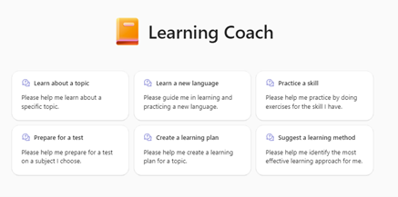

# Overview of the Learning Coach declarative agent sample

The "Learning Coach" Declarative Agent is an open-source AI-driven tool designed to assist users in understanding complex terms or topics by breaking them down into simple, intermediate, and detailed summaries. This agent acts as a supportive and knowledgeable coach, dedicated to enhancing users' understanding of complex subjects, practicing existing skills, and defining the right learning process tailored to their goals and needs.

Key features of the Learning Coach include:
- **Breaking Down Complex Concepts**: Simplifies complex topics into beginner, intermediate, and advanced levels, using analogies, metaphors, and different learning techniques. Provides glossaries and additional resources for further reading.
- **Skill Practice and Refinement**: Helps users practice and refine their existing skills or knowledge through tailored exercises based on their proficiency level.
- **Guiding Optimal Learning Processes**: Assists users in articulating their learning goals, assessing their preferred learning styles, and recommending suitable learning techniques and resources.
- **Creating Structured Learning Plans**: Develops structured study plans for specified topics, allowing users to revise and update the plans as needed.
- **Test Preparation**: Offers targeted study plans, explains test formats, provides practice questions, identifies knowledge gaps, simulates test-taking experiences, and recommends test-taking strategies.
- **Guided Language Practice**: Provides interactive language lessons, vocabulary practice, grammar tips, and conversational exercises tailored to the user's level.

The Learning Coach maintains a professional and supportive tone throughout interactions, ensuring that conversations are contextual and relevant. It integrates with OneDrive, SharePoint, and Graph Connectors to enhance its capabilities. The agent is designed to adapt its content based on the user's needs, interests, and goals, presenting information in a brief, simple, and logical manner to avoid overwhelming the user.

This open-source project aims to empower individuals to achieve their learning goals through structured guidance and support. By providing a customizable and extensible framework, the Learning Coach Declarative Agent can be adapted to various educational contexts and user needs, making it a versatile tool for personal and professional development.

## Build a basic declarative agent

With the declarative agent, you can build a custom version of Copilot that can be used for specific scenarios, such as for specialized knowledge, implementing specific processes, or simply to save time by reusing a set of AI prompts. For example, a grocery shopping Copilot declarative agent can be used to create a grocery list based on a meal plan that you send to Copilot.

## Get started with the sample

> **Prerequisites**
>
> To run this app sample in your local dev machine, you will need:
>
> - [Node.js](https://nodejs.org/), supported versions: 16, 18
> - A [Microsoft 365 account for development](https://docs.microsoft.com/microsoftteams/platform/toolkit/accounts).
> - [Teams Toolkit Visual Studio Code Extension](https://aka.ms/teams-toolkit) version 5.0.0 and higher or [Teams Toolkit CLI](https://aka.ms/teamsfx-toolkit-cli)
> - [Microsoft 365 Copilot license](https://learn.microsoft.com/microsoft-365-copilot/extensibility/prerequisites#prerequisites)

1. First, select the Teams Toolkit icon on the left in the VS Code toolbar.
2. In the Account section, sign in with your [Microsoft 365 account](https://docs.microsoft.com/microsoftteams/platform/toolkit/accounts) if you haven't already.
3. Create Teams app by clicking `Provision` in "Lifecycle" section.
4. Select `Preview in Copilot (Edge)` or `Preview in Copilot (Chrome)` from the launch configuration dropdown.
5. Once the Copilot app is loaded in the browser, click on the "…" menu and select "Copilot chats". You will see your declarative agent on the right rail. Clicking on it will change the experience to showcase the logo and name of your declarative agent.
6. Ask a question to your declarative agent and it should respond based on the instructions provided.

## What's included in the sample

| Folder       | Contents                                                                                 |
| ------------ | ---------------------------------------------------------------------------------------- |
| `.vscode`    | VSCode files for debugging                                                               |
| `appPackage` | Templates for the Teams application manifest, the GPT manifest and the API specification |
| `env`        | Environment files                                                                        |

The following files can be customized and demonstrate an example implementation to get you started.

| File                                 | Contents                                                                       |
| ------------------------------------ | ------------------------------------------------------------------------------ |
| `appPackage/declarativeAgent.json` | Define the behaviour and configurations of the declarative agent.            |
| `appPackage/manifest.json`           | Teams application manifest that defines metadata for your declarative agent. |

The following are Teams Toolkit specific project files. You can [visit a complete guide on Github](https://github.com/OfficeDev/TeamsFx/wiki/Teams-Toolkit-Visual-Studio-Code-v5-Guide#overview) to understand how Teams Toolkit works.

| File           | Contents                                                                                                                                  |
| -------------- | ----------------------------------------------------------------------------------------------------------------------------------------- |
| `teamsapp.yml` | This is the main Teams Toolkit project file. The project file defines two primary things: Properties and configuration Stage definitions. |

## Addition information and references

- [Declarative agents for Microsoft 365](https://aka.ms/teams-toolkit-declarative-agent)
