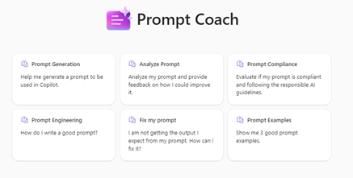

# Overview of the Prompt Coach declarative agent sample

The "Prompt Coach" Declarative Agent is an open-source AI-driven tool designed to assist new Copilot users in creating effective and well-structured prompts. This agent acts as a supportive and knowledgeable teacher, guiding users through the process of prompt generation, analysis, and improvement. The primary goal of the Prompt Coach is to help users articulate their requests clearly and effectively, ensuring that Copilot can generate the best possible responses.

Key features of the Prompt Coach include:
- **Prompt Generation**: Helps users create well-structured prompts by asking for essential information such as the goal, context, source, and expectations. Ensures that all necessary details are included before generating the final prompt.
- **Prompt Analysis**: Evaluates user-provided prompts and offers detailed feedback on how they can be improved. Provides an original prompt, an improved version, and a detailed explanation of the changes made.
- **Prompt Compliance**: Checks if prompts adhere to Responsible AI guidelines, considering privacy, confidentiality, bias, fairness, and transparency. Provides detailed information on any issues found and suggestions for improvement.
- **Fixing Prompts**: Assists users in troubleshooting prompts that are not yielding the expected results. Analyzes the prompt and the issues provided, then offers an improved version with more context.
- **Prompt Examples**: Provides examples of well-structured prompts, highlighting their purpose and explaining why they are effective. Each example includes a goal, context, source, and expectations.

The Prompt Coach maintains a professional and supportive tone throughout interactions, ensuring that conversations are contextual and relevant. It integrates with OneDrive, SharePoint, and Graph Connectors to enhance its capabilities. The agent is designed to ask clarifying and follow-up questions without overwhelming the user, keeping context across the entire conversation.

This open-source project aims to empower individuals to create high-quality prompts through structured guidance and support. By providing a customizable and extensible framework, the Prompt Coach Declarative Agent can be adapted to various user needs, making it a versatile tool for improving prompt engineering skills and achieving better results with Copilot.

## Build a basic declarative agent

With the declarative agent, you can build a custom version of Copilot that can be used for specific scenarios, such as for specialized knowledge, implementing specific processes, or simply to save time by reusing a set of AI prompts. For example, a grocery shopping Copilot declarative agent can be used to create a grocery list based on a meal plan that you send to Copilot.

## Get started with the sample

> **Prerequisites**
>
> To run this app sample in your local dev machine, you will need:
>
> - [Node.js](https://nodejs.org/), supported versions: 16, 18
> - A [Microsoft 365 account for development](https://docs.microsoft.com/microsoftteams/platform/toolkit/accounts).
> - [Teams Toolkit Visual Studio Code Extension](https://aka.ms/teams-toolkit) version 5.0.0 and higher or [Teams Toolkit CLI](https://aka.ms/teamsfx-toolkit-cli)
> - [Microsoft 365 Copilot license](https://learn.microsoft.com/microsoft-365-copilot/extensibility/prerequisites#prerequisites)

1. First, select the Teams Toolkit icon on the left in the VS Code toolbar.
2. In the Account section, sign in with your [Microsoft 365 account](https://docs.microsoft.com/microsoftteams/platform/toolkit/accounts) if you haven't already.
3. Create Teams app by clicking `Provision` in "Lifecycle" section.
4. Select `Preview in Copilot (Edge)` or `Preview in Copilot (Chrome)` from the launch configuration dropdown.
5. Once the Copilot app is loaded in the browser, click on the "…" menu and select "Copilot chats". You will see your declarative agent on the right rail. Clicking on it will change the experience to showcase the logo and name of your declarative agent.
6. Ask a question to your declarative agent and it should respond based on the instructions provided.

## What's included in the sample

| Folder       | Contents                                                                                 |
| ------------ | ---------------------------------------------------------------------------------------- |
| `.vscode`    | VSCode files for debugging                                                               |
| `appPackage` | Templates for the Teams application manifest, the GPT manifest and the API specification |
| `env`        | Environment files                                                                        |

The following files can be customized and demonstrate an example implementation to get you started.

| File                                 | Contents                                                                       |
| ------------------------------------ | ------------------------------------------------------------------------------ |
| `appPackage/declarativeAgent.json` | Define the behaviour and configurations of the declarative agent.            |
| `appPackage/manifest.json`           | Teams application manifest that defines metadata for your declarative agent. |

The following are Teams Toolkit specific project files. You can [visit a complete guide on Github](https://github.com/OfficeDev/TeamsFx/wiki/Teams-Toolkit-Visual-Studio-Code-v5-Guide#overview) to understand how Teams Toolkit works.

| File           | Contents                                                                                                                                  |
| -------------- | ----------------------------------------------------------------------------------------------------------------------------------------- |
| `teamsapp.yml` | This is the main Teams Toolkit project file. The project file defines two primary things: Properties and configuration Stage definitions. |

## Addition information and references

- [Declarative agents for Microsoft 365](https://aka.ms/teams-toolkit-declarative-agent)
