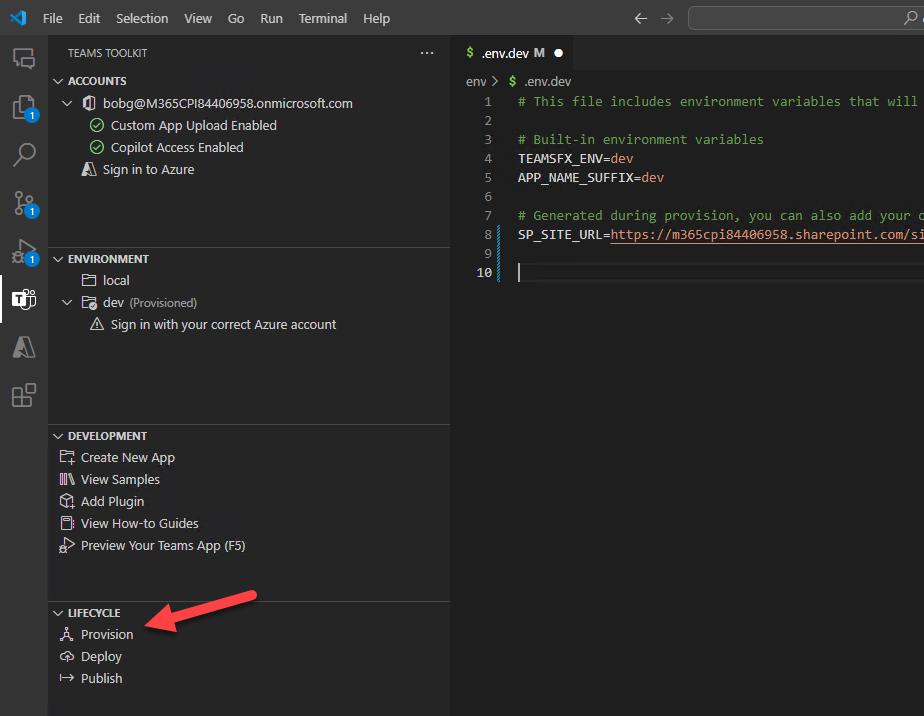

# Environment Sustainability Agent (ESA)

The **ESA - The Environment Sustainability Agent** is an intelligent assistant designed to help organizations monitor and optimize their environmental impact. It analyzes data on energy consumption,environment compliance, and carbon emissions, providing actionable insights to reduce inefficiencies and enhance sustainability practices. By guiding companies toward more eco-friendly operations, this AI helps achieve long-term sustainability goals while reducing operational costs.

## Summary

This sample illustrates the following concepts:

- Building a declarative agent for Microsoft 365 Copilot with instructions
- Adding a SharePoint capability to the agent

## Prerequisites

* Microsoft 365 tenant with Microsoft 365 Copilot
* [Visual Studio Code](https://code.visualstudio.com/) with the [Teams Toolkit](https://marketplace.visualstudio.com/items?itemName=TeamsDevApp.ms-teams-vscode-extension) extension
* [Node.js v18](https://nodejs.org/en/download/package-manager)

## Contributors

* [Rabia Williams](https://github.com/rabwill)

## Version history

Version|Date|Comments
-------|----|----
1.0|October 22, 2025|Initial release

## Disclaimer

**THIS CODE IS PROVIDED *AS IS* WITHOUT WARRANTY OF ANY KIND, EITHER EXPRESS OR IMPLIED, INCLUDING ANY IMPLIED WARRANTIES OF FITNESS FOR A PARTICULAR PURPOSE, MERCHANTABILITY, OR NON-INFRINGEMENT.**

---

## Minimal Path to Awesome

* Clone this repository and in your Visual Studio Code, open folder  **samples/da-environmentSustainability**
* Alternatively you can also  [download this solution as a .ZIP file](https://pnp.github.io/download-partial/?url=https://github.com/pnp/copilot-pro-dev-samples/tree/main/samples/da-environmentSustainability) then unzip it and go to **samples/da-environmentSustainability** folder from your Visual Studio Code window
* Open the Teams Toolkit extension and sign in to your Microsoft 365 tenant with Microsoft 365 Copilot
* Copy the doc file `SustainabilityReports.docx` in **docs** folder and upload into a SharePoint site in the same Microsoft 365 tenant which you used to sign to Teams Toolkit
* Update the environment variable `SP_SITE_URL` in the **.env.dev** file with value of the SharePoint site where the doc was uploaded
* Under the Teams Toolkit tab in Visual Studio Code, click "Provision" to install the application

* Go to Copilot app and on the agent panel choose **da-environmentSustainability**
* Use the conversation starters to see the magic!

## Features

- Declarative agent with SharePoint capability

